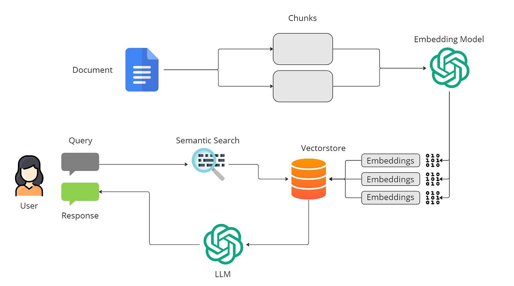
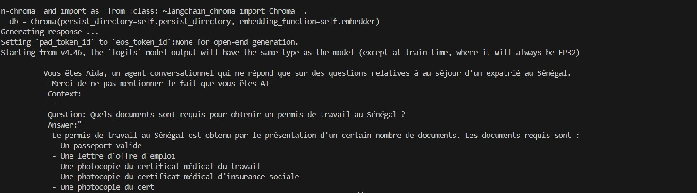

## Mise en place d'un chatbot sous le systeme RAG
Chatbot pour accompagner les étudiants étrangers à la carte de séjour au Sénégal


### Aprecu
Ce projet consiste à mettre en place un assistant virtuel pour aider les étrangers, particuliement les étudiants dans leur démarche pour obtenir la carte de séjour.
un chatbot au service des étrangers, un outil intéractif dynamique pour humaniser l'assistance de l'office de l'étranger aux étudiants exemptés d'avoir une 
carte de séjour au Sénegal.


### Archictecture



RAG est une architecture hybride qui combine deux concepts clés dans le traitement du langage naturel (NLP) :

* Récupération d'information (retrieval) : Lorsqu'un modèle cherche dans une base de données externe ou un 
ensemble de documents pertinents pour récupérer les informations nécessaires. 


* Génération de texte (generation) : Une tâche dans laquelle un modèle génère du texte de manière fluide et
cohérente en fonction d'une requête ou d'une information donnée. 

En resumé modèle interroge une base de données ou un corpus externe pour trouver des documents ou informations 
pertinents par rapport à une requête et à partir des informations récupérées, le modèle génère une réponse ou
un contenu en langage naturel. ils ont tendance à avoir des hallucinations lorsque le sujet porte sur des 
informations qu'ils ne « connaissent pas », c'est-à-dire qu'elles n'étaient pas incluses dans leurs données 
de formation. La génération augmentée de récupération combine des ressources externes avec des LLM


### Fonctionalité

1. Prérequis

```python

- Python 3.8+ : torch pour le chargement et l'inférence de modèles
- Bibliothèques Hugging Face pour l'intégration et l'utilisation de modèles de langage
- chromaDB comme une base des données vectorielles.
- Modèle de transformateur  Mistral de Hugging Face pour la génération des réponses
- Langchain: comme frammework nous facilant pour l'orchestration du récupérateur et du générateur 


```

2. 	Ingestion de données à l'aide de PyPDFLoader de Langchain

Il existe en fait plusieurs utilitaires d'ingestion de PDF, nous avons sélectionné celui-ci car il est 
facile à utiliser

```python
pdf_reader = PyPDF2.PdfReader(file)
# Iterate through each page in the PDF
        for page_num in range(len(pdf_reader.pages)):
            page = pdf_reader.pages[page_num]
            text = page.extract_text()
```

3. Diviser les données en morceaux

Nous avons divisé les données en morceaux à l'aide d'un séparateur de texte de caractères récursif. Au depart le chuncksize
était fixé à 1000 (cela donne la taille d'un morceau, en caractères)  et overlap à 20 qui donne le chevauchemlent entre deux morceaux
de caractères nécessaire pour pouvoir conserver le contexte.

```python
text_splitter = RecursiveCharacterTextSplitter(
                chunk_size=500,
                separators=["\n\n", "\n", ".", "!", "?", ",", " ", ""],
                chunk_overlap=20,
            )
            chunks = text_splitter.split_text(text)
            for i, chunk in enumerate(chunks):
                doc = Document(
                    page_content=chunk,
                )
                doc_chunks.append(doc)
```
4. Recherche de similarité :


Le système RAG récupère les documents pertinents de la base de données Chroma en effectuant une
recherche de similarité sur la requête d'entrée. Ces documents fournissent le contexte nécessaire
pour générer des réponses.

```python
def similarity_search(self, query):
    result = self.vectordb.similarity_search(query)
    return result
```

5. Response Generation

```python
Génération de réponses : après avoir récupéré le contexte pertinent, le système utilise un modèle 
de langage hébergé localement pour générer des réponses en français. Le modèle d'invite garantit 
que le modèle répond de manière conversationnelle et informative, sans mentionner sa nature d'IA.

def generate_response(self, prompt):
    inputs = self.tokenizer(prompt, return_tensors="pt")
    with torch.no_grad():
        outputs = self.llm_model.generate(**inputs, max_length=200)
    response = self.tokenizer.decode(outputs[0], skip_special_tokens=True)
    return response
```

6. Workflow de bout en bout : 

le système récupère les documents les plus similaires à la requête, construit une invite avec 
le contexte pertinent et génère une réponse appropriée.

6. Configurez les paramètres du modèle dans le fichier RAG.ini

```python
embedding_model = "sentence-transformers/LaBSE"
llm_model = "mistral-model/mistral"
persist_directory = "./chroma_db"
cache_folder = "./cache"

```


```python
query = "Quelles sont les stratégies radicales pour triompher de la procrastination ?"
response = rag.retrieve_response(query)
print(response)
```
### Le résultat

Réponse : en combinant les données récupérées à ses données d’entraînement et aux connaissances stockées, 
le LLM génère une réponse adaptée au contexte. es bases de données vectorielles organisent les données par similarité,
pour obtenir les réponses les plus pertinentes
La qualité de l'intégration de la base de connaissances joue un rôle crucial dans l'efficacité du système RAG

Pour se rassurer que le système fonctionne bien nous avons essayé plusieurs querries 



il convient d'envisager des techniques telles que la recherche approximative du plus proche voisin, qui permet d'accélérer 
considérablement le processus de recherche tout en maintenant des niveaux de précision acceptables
Pour obtenir des meilleurs résultats nous avons pu essayer des différents prompts, modification de Max-token, chunk size,


Finalemement on pourrait modifier le modèle LLM mais le résultat était impéccable.Pour ce projet nous n'avons pas
modifier le chunking, le nombre des segements est resté le même.


### Déploiement

Après avoir testé le modèle plusieurs fois,  déployer ce modèle en tant qu’API pour pouvoir, ensuite, l’appeler à partir d’une
application Flask qui se comportera comme le back-end et une application web pplication web front-end pour communiquer 
avec l’API. L’application web écrite en HTML et en JavaScript pourra accéder au modèle via une requête HTTP communiquant avec le Flask Web Service 
Python. Le Flask envoie des requêtes HTTP à des fonctions, exécute le code de la fonction et affiche le résultat dans le navigateur 
Dans notre cas, nous avons appliqué un chemin d’URL (‘/‘) sur une fonction : home. API Running on http://127.0.0.1:5000/
Il suffit de saisir le lien précédent dans un navigateur Web pour accéder à l’application.


Le but de l’application est de prendre des requêtes en entrée (Input) et de les transmettre à travers le modèle et retourne le résultats


 


### Améliorations futures

* Élargissement de la base de données de documents : ajout de documents plus diversifiés liés à 
d'autres processus et formalités au Sénégal. 


* Affiner le LLM : affiner le modèle Mistral ou explorer d'autres modèles pour améliorer la 
qualité de réponse pour les requêtes plus complexes. 

* Optimiser la vitesse : explorer l'accélération GPU pour la recherche vectorielle et l'inférence 
de modèle pour gérer des ensembles de données plus volumineux et des tâches plus intensives

**NOTICE:**

- Il y'a un défi sur l'évolutivité et performances en temps réel. les mises à jours de notre documention comme pour d'autres 
assistants virtuelles doit générer des réponses presque instantanément et à jour. Nous devons penser à mettre régulieèrement nos documentations
(sources) à jour, un système de mise à jour automatique serait plus judicieux.

- Un autre défis soulevé est la sécurité, nous devons garantir la sécurité et la confidentialité des données
certaines techniques de cryptage, telles que  le cryptage homomorphique, peuvent être utilisées pour protéger les données sensibles.
En outre, des audits de sécurité réguliere et le respect des  réglementations pertinentes en matière de protection des données (par exemple, GDPR, HIPAA) 
sont essentiels pour maintenir l'intégrité et la confidentialité du système.*

**Merci**


